# MSI-MAG-B560M-MORTAR-i7-10700
## 配置 Info

macOS Big Sur 11.5.1 + OpenCore 0.7.1

| 组件 | 名称                                            |
| ---- | ----------------------------------------------- |
| CPU  | i7 10700                                        |
| 主板 | 微星 B560M 迫击炮 （MSI MAG-B560M-MORTAR-WIFI） |
| 显卡 | 蓝宝石 RX460 4GB 超白金版 + intel UHD 630       |
| 网卡 | BCM94360CD 4 天线版本                           |
| 机型 | iMac 20,1                                       |

- [x] 睡眠唤醒
- [x] 核显驱动
- [x] 双硬解
- [x] CPU 变频
- [x] WiFi 和 蓝牙
- [x] 接力和隔空投送

其他不完美的地方有

- 朋友手上没有 Type-C 设备，所以 USB 定制漏了个 Type-C

## 细节 Detail

使用 OpenCore 0.7.2

 

安装最新版本的 macOS Big Sur 11.5.1

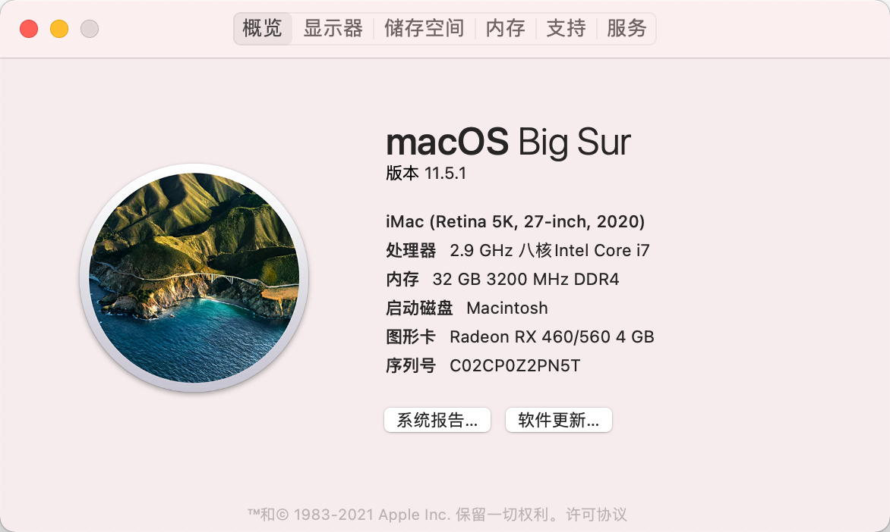 

Hackintool 里面各项参数识别均正常，切完全支持 VDA 解码器：

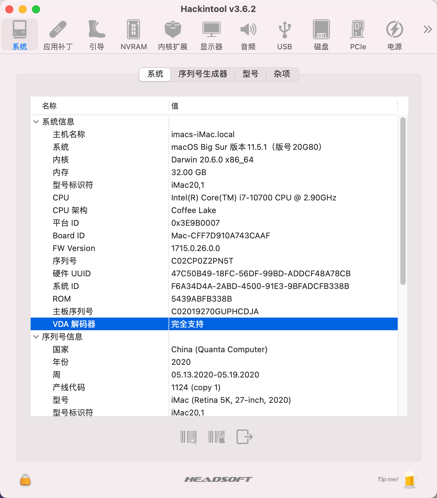 

值得一提的是居然在图形显卡里面可以看到两个显卡，印象中双显卡是 MBP 专属的：

 

因为驱动了核显，所以双硬解也都正常的：

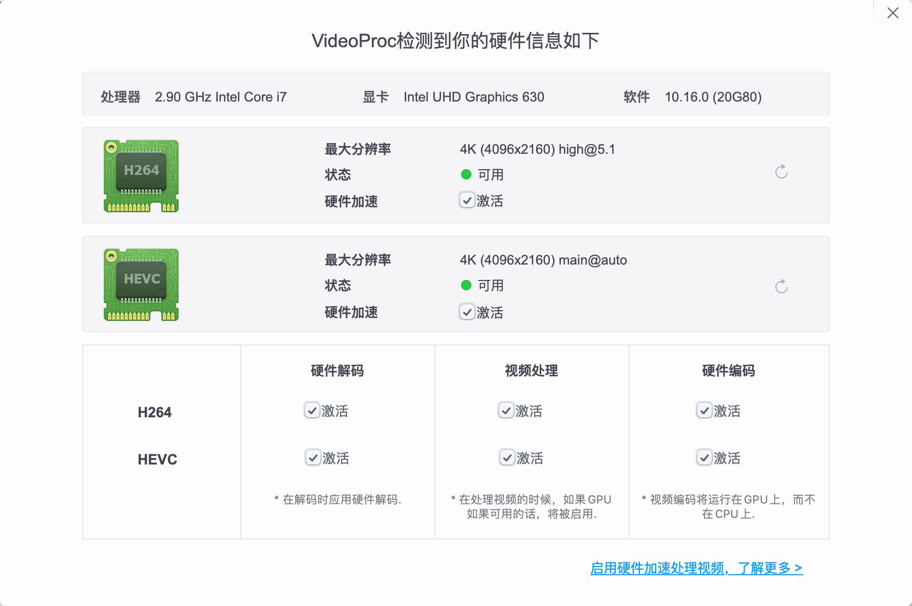 

CPU 变频正常，也可以正常检测到核显的频率：

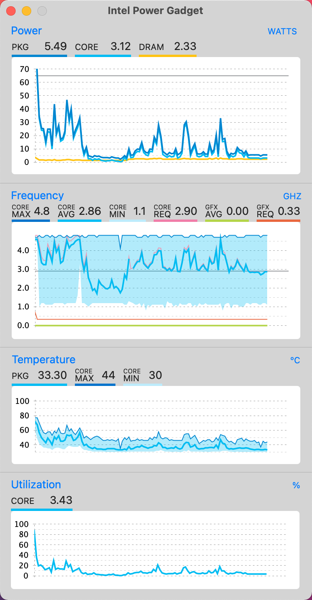 

GeekBench5 CPU 的多核跑分有点意外，超过 10 代 i9 了：

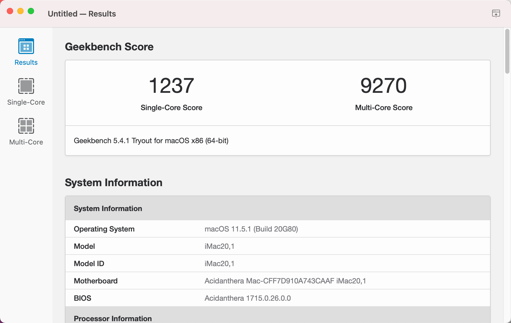 

AMD RX460 的跑分：

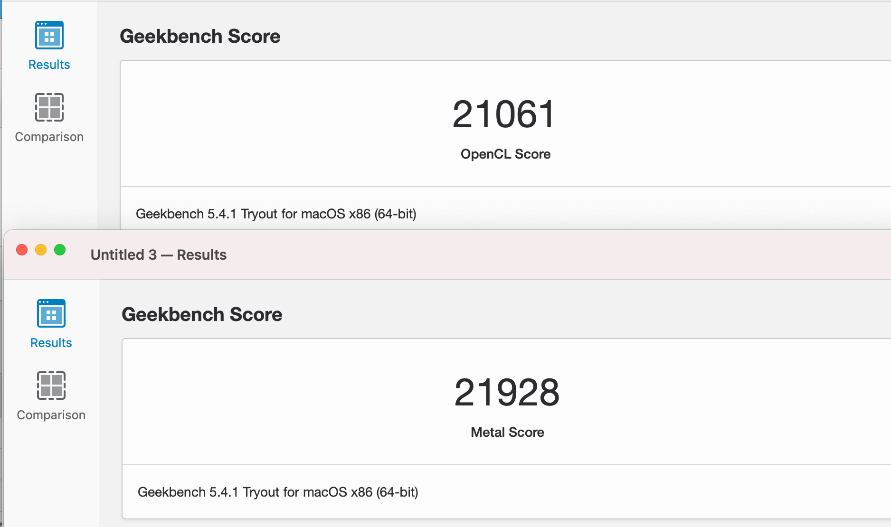 

Intel UHD630 的跑分：

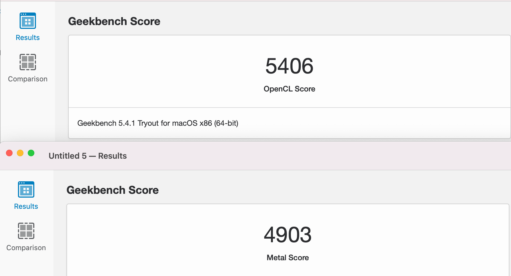 

可以看出来 RX460 大概是核显的 4 倍性能左右，所以带 4k 的话，独显还是很有必要的。

另外各项传感器也均正常的： 

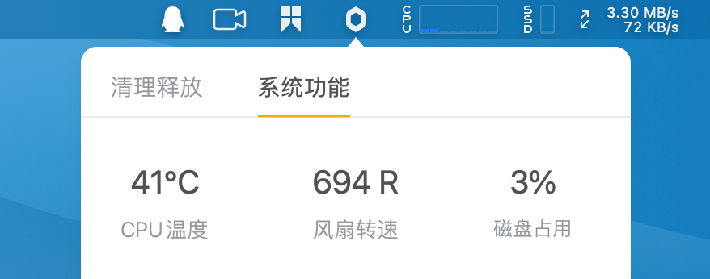 

 ## 更新 Update

更换了免驱的 BCM94360CD 打了 kexts 目前 WiFi 和 蓝牙也都正常工作：

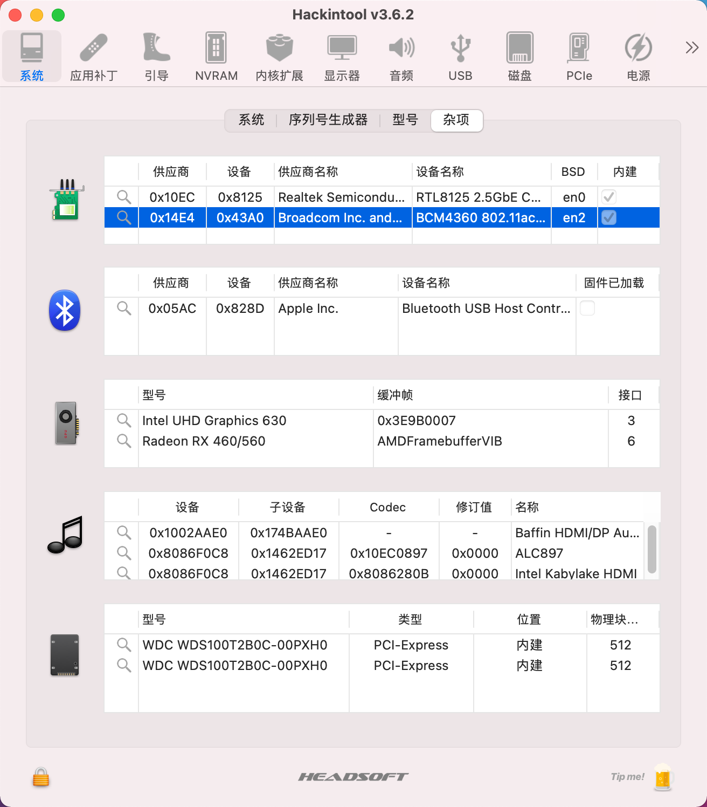

WiFi 详情：

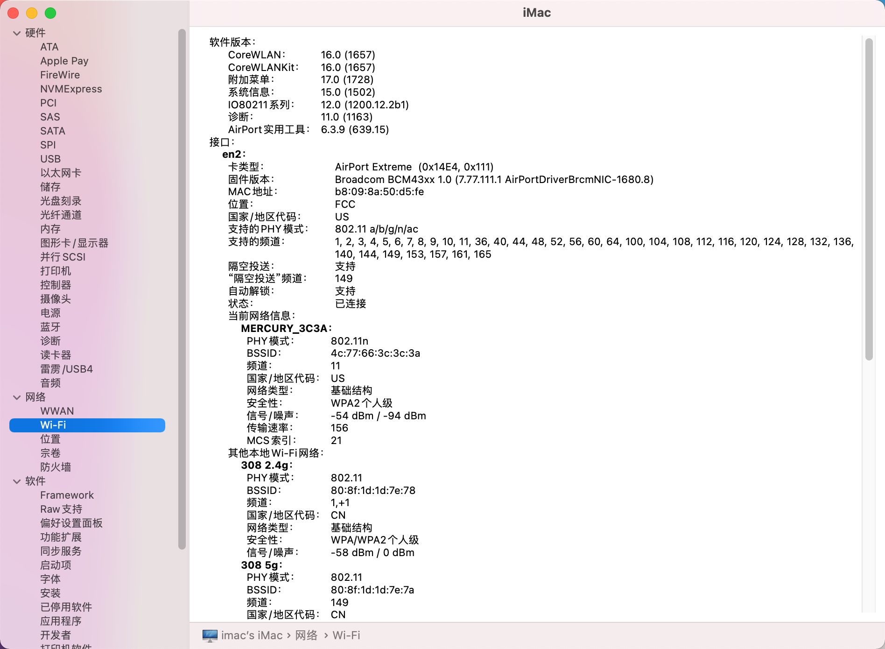 

蓝牙详情：

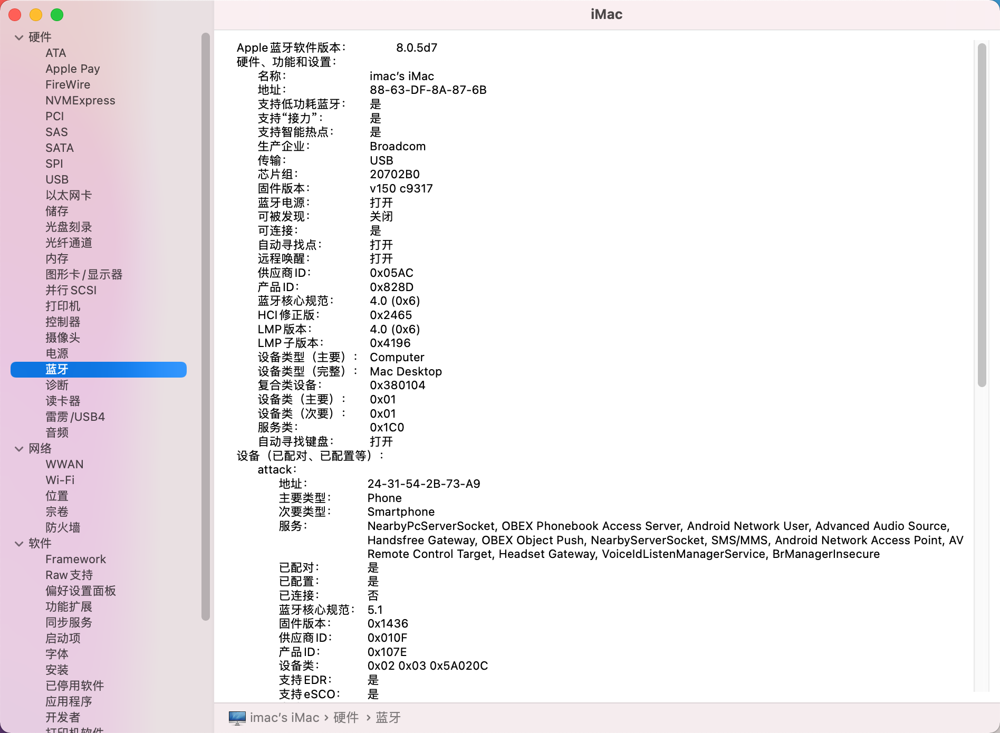 

可以正常连接使用设备：

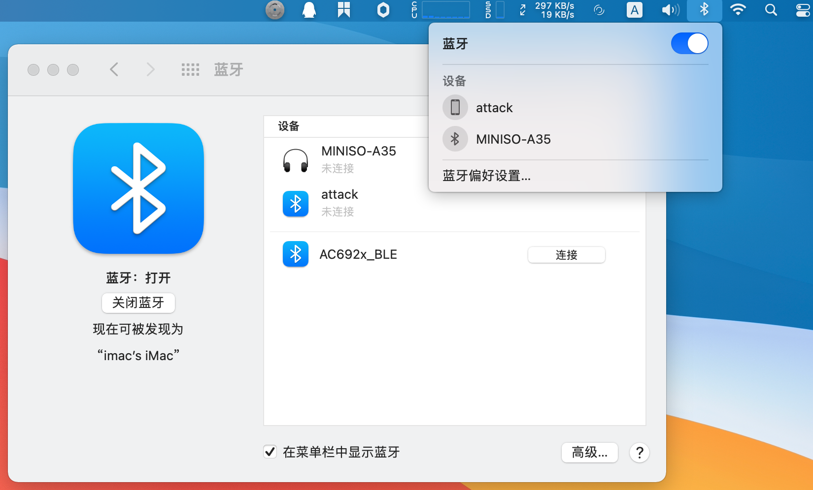 

所以这个 Big Sur 的控制中心目前就完美了：

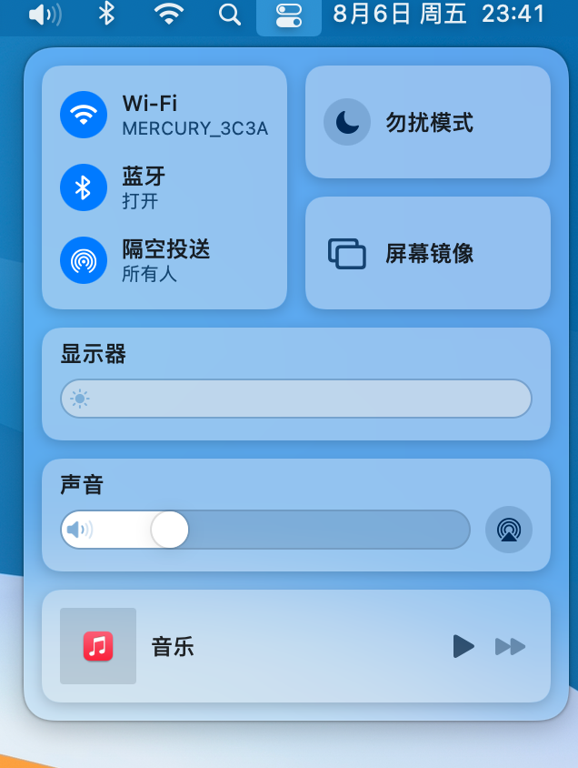 

最后顺便重新定制了下 USB，目前全部正常工作：

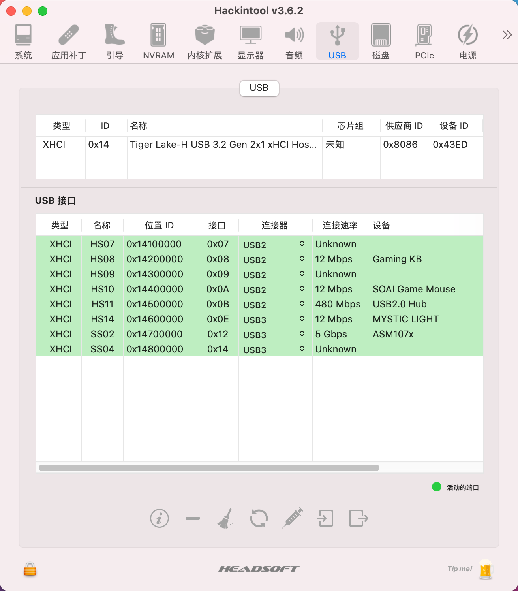 

至此，这套配置的黑苹果驱动完美程度接近 99% +了，后面使用类似配置网友可以直接拿去使用。

## 支持一下  Reward

因为黑苹果驱动定制是很耗费时间的事情，为了追求完美需要各种优化，生活不易，猫猫叹气，如果你恰巧财力雄厚的话，可以考虑打赏下本文哦，打赏情况国光我也会同步更新我的打赏列表的：[打赏列表 | 国光](https://www.sqlsec.com/dashang.html) 

<table>
    <tr>
        <td>
            

        </td>
        <td width="50%">
            

        </td>
    </tr>
</table>

